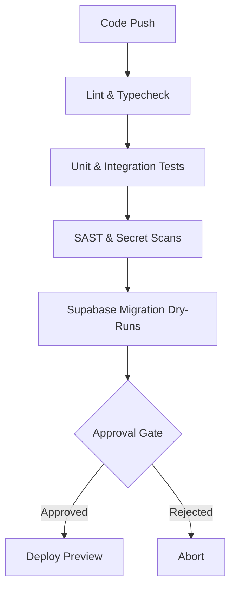

# Harness Testing & CI/CD Pipeline Plan

This document proposes a comprehensive test execution, static analysis, security scanning, and deployment gate pipeline using Harness.



---

## 🛠️ Pipeline Stages

### Stage 1: Build & Validate
* **Linting:** Run `npm run lint` (frontend) and `flake8` or `black` (python backend) to enforce code standards.
* **Typechecking:** Execute `npm run typecheck` (Vite TS compiler) to catch type errors before bundling.

### Stage 2: Automated Testing
* **Python backend:** Execute unit tests and tool suite verifications:
  ```bash
  venv/bin/pytest tests/test_tools.py test_logic.py -v
  ```
* **Frontend:** Execute frontend component testing (e.g. via Jest or Vitest) if added to the dashboard.

### Stage 3: Security & Compliance
* **Secret Scanning:** Scan files for plain-text keys (Alpaca, Supabase, Anthropic, Telegram) using Harness Secret Detection.
* **Dependency Audits:** Check packages for known vulnerabilities via `npm audit` and `safety` (Python).
* **SAST (Static Application Security Testing):** Integrate Harness Security Testing (ST) to scan code structures.

### Stage 4: Database Migration Dry-Run
* Execute Supabase migration verifications in a local or staging environment to confirm schema integrity before pushing SQL updates to production.

---

## 🚦 Production Deployment Gates
Harness pipeline approvals should require:
1. **100% test completion** across the python/typescript test suites.
2. **Zero high-severity vulnerabilities** in dependency scans.
3. **Manual peer approval** before publishing deployments to production.
